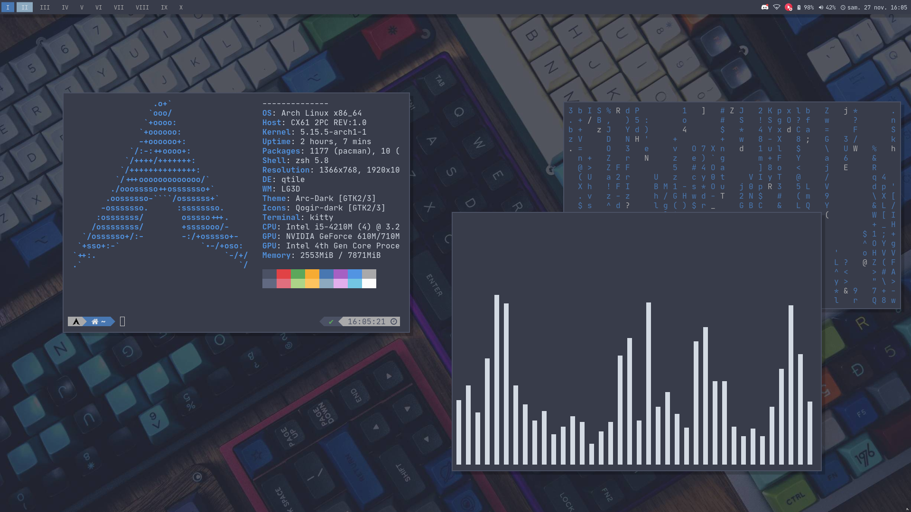

# Dotfiles

Hello and welcome to my dotfiles!  
In here you can find every configuration I am using for this month to make my desktop look cool!  
Please enjoy!

# Screenshot

# Basic information

This section contains lots of informations about what I'm actually using in my configuration to get a cool desktop

# Fetch Program

The fetch program is one I made quickly using Python. To install it, you just need to copy it to `~/.fetch.py` and install the `colorama` python package.

## Main components

* **OS:** Arch Linux x86-64
* **Desktop:** Qtile on Xorg
* **Display Manager:** Lightdm/GTK Greeter
* **Compositor:** Picom [(ibhagwan's fork)](https://github.com/ibhagwan/picom)
* **Polycikit:** Xfce4 policy agent

* **Shell:** Zsh/OhMyZsh
* **Zsh Theme:** PowerLevel10K

## Desktop elements
 
* **Bar:** Polybar
* **Runner:** Rofi
* **Wallpaper:** Nitrogen [(gallery here)](https://github.com/khyrthy/wallpapers)

## Applications

* **Terminal Emulator:** Kitty
* **Web Browser:** Firefox
* **VM Manager:** VirtualBox
* **File Manager:** PcmanFM/ranger

## Desktop goods

* **Fetch:** Custom
* **Matrix:** Cmatrix
* **Visualizer:** Cava (pulseaudio)

