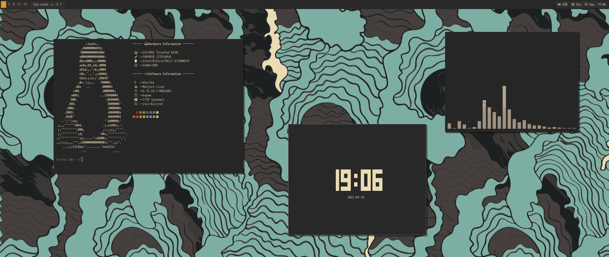

# Dotfiles

Here are all my configuration files for this current theme.

## Preview

## System Information

* **Distro :** Manjaro Linux
* **Window Manager :** [BSPWM](https://github.com/baskerville/bspwm)
* **Terminal :** [Alacritty](https://github.com/alacritty/alacritty)
* **Bar :** [Polybar](https://github.com/polybar/polybar)
* **System Information :** [Sysfex](https://github.com/mehedirm6244/sysfex)
* **Visualizer :** [Cava](https://github.com/karlstav/cava)
* **Clock :** [Rofi](https://github.com/davatorium/rofi)

## Theme information

This theme is based on [Gruvbox](https://github.com/morhetz/gruvbox). It is a retro-vibrant color scheme that makes you feel like you are an eighty beared-geek.

## Wallpaper

The wallpaper is part of [this collection from FrenzyExists](https://github.com/FrenzyExists/wallpapers).